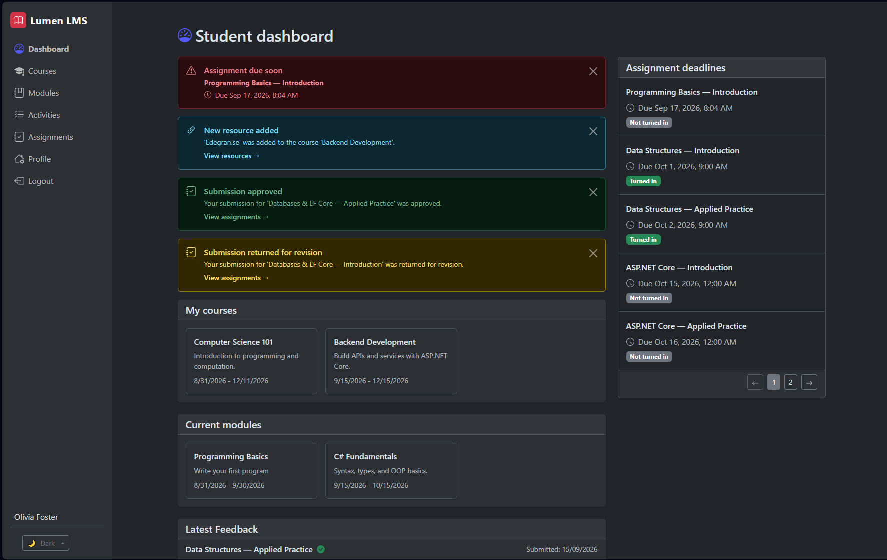

<small>LEXICON • FRONTEND • SLUTPROJEKT</small>

# LMS Portal Frontend (ImsPortalFe)



## Project Purpose

The purpose of this project is to build a robust, responsive, and user-centric Single Page Application (SPA) Learning Management System (LMS) tailored for Lexicon's professional IT training programs. Operating as a full-stack educational portal alongside an ASP.NET Core Web API backend, the frontend application centralizes communication between students, teachers, and administrators. It provides streamlined access to course schedules, module timelines, study resources, activity tracking, and text-based submissions while reducing cognitive load and unnecessary UI complexity ("Less is more").

- **Frontend Repository:** [NiklasSod/lmsPortalFe](https://github.com/NiklasSod/lmsPortalFe)
- **Backend Repository:** [NiklasSod/lmsPortalBe](https://github.com/NiklasSod/lmsPortalBe)

## Core Technologies

- **React 19 & TypeScript:** Modern, strictly typed component-driven architecture leveraging functional components, custom hooks (`useTheme`, `useAuth`), and strict type safety across all domain models, props, and API states.
- **Vite:** High-performance frontend build tool and development server providing lightning-fast Hot Module Replacement (HMR) and optimized production bundling.
- **React-Bootstrap & Bootstrap 5:** Responsive UI component framework providing clean, consistent styling, adaptive grid layouts, dropdowns, and interactive modals.
- **Architecture & SoC:** Strict Separation of Concerns featuring decoupled API communication layers, context providers (`AuthContext`, `EditModeContext`), and utility handlers.

## Project Structure

The project features a well-organized, modular architecture designed for scalability and maintainability:

```text
/ImsPortalFe
 ├── .vscode/               # Workspace configuration settings
 ├── docs/                  # Documentation
 │   ├── preview.png
 │   └── theme-poc.html
 ├── public/                # Static assets, favicons, and proofs-of-concept
 │   └── favicon.svg
 ├── src/                   # Frontend source code
 │   ├── api/               # API client service modules
 │   │   ├── activity.ts
 │   │   ├── assignment.ts
 │   │   ├── auth.ts
 │   │   ├── course.ts
 │   │   ├── module.ts
 │   │   ├── notification.ts
 │   │   ├── resource.ts
 │   │   ├── submission.ts
 │   │   ├── user.ts
 │   │   └── userProfile.ts
 │   ├── auth/              # Authentication context and provider components
 │   │   ├── AuthContext.ts
 │   │   └── AuthProvider.tsx
 │   ├── components/        # Reusable domain-specific and global UI components
 │   │   ├── assignments/   # Assignment cards, modals, and submission lists
 │   │   ├── courses/       # Course grids, sections, and deletion modals
 │   │   ├── dashboard/     # Summary cards, deadlines, and notification alerts
 │   │   ├── modules/       # Module activities lists and cards
 │   │   ├── profile/       # User profile details, skills, and account forms
 │   │   ├── resources/     # Resource inline displays and management modals
 │   │   ├── editMode/      # Context providers for toggleable teacher edit controls
 │   │   └── ...            # AppLayout, AppNavbar, ThemeSwitch, PaginationControls, etc.
 │   ├── hooks/             # Custom application hooks (e.g., useTheme)
 │   ├── routes/            # Role-based routing configurations (Student/Teacher routes)
 │   ├── types/             # Pure TypeScript definitions and interfaces
 │   │   ├── activity.ts
 │   │   ├── assignment.ts
 │   │   ├── auth.ts
 │   │   ├── course.ts
 │   │   ├── dashboard.ts
 │   │   ├── module.ts
 │   │   ├── notification.ts
 │   │   ├── resource.ts
 │   │   ├── student.ts
 │   │   ├── submission.ts
 │   │   ├── theme.ts
 │   │   └── userProfile.ts
 │   ├── utils/             # Helper functions and business logic utilities
 │   │   ├── apiError.ts
 │   │   ├── apiFetch.ts
 │   │   ├── submissionStatus.ts
 │   │   ├── themeHandler.ts
 │   │   └── tokenExpiry.ts
 │   ├── views/             # Page-level view components organized by domain feature
 │   │   ├── activities/    # Activities views
 │   │   ├── assignments/   # Assignments management and overview
 │   │   ├── auth/          # Login and account creation views
 │   │   ├── courses/       # Course overview, modules, members, and resource views
 │   │   ├── dashboard/     # Role-tailored landing dashboards
 │   │   ├── modules/       # Module management views
 │   │   └── profile/       # User profile view
 │   ├── App.tsx            # Root application component and router provider setup
 │   ├── index.css          # Global styling overrides and theme rules
 │   └── main.tsx           # React DOM application mount entry point
 ├── .gitignore
 ├── .prettierignore
 ├── .prettierrc.json
 ├── CONTRIBUTORS.md
 ├── eslint.config.ts
 ├── index.html             # Main HTML document template
 ├── LICENSE.md
 ├── package-lock.json
 ├── package.json           # Project dependencies and npm scripts
 ├── pnpm-lock.yaml
 ├── README.md              # Project documentation file
 ├── tsconfig.app.json      # Frontend TypeScript compiler options
 ├── tsconfig.json          # Root TypeScript configuration
 ├── tsconfig.node.json     # Vite config TypeScript options
 ├── vercel.json            # Deployment configuration rules
 └── vite.config.ts         # Vite bundler configuration
```

## Core LMS Features & Use-Cases

### 1. Authentication & Role-Based Access

- Secure JWT-based authentication supporting role differentiation for **Students** and **Teachers**.
- Seamless session state maintenance with protected routes (`StudentRoutes`, `TeacherRoutes`).

### 2. Courses & Modules Management

- **Students:** Can view their assigned course, peer course members, structured module schedules, and non-overlapping timeline breakdowns.
- **Teachers:** Empowered with administrative views to create, update, and manage courses, modules, and synchronized chronological activities.

### 3. Activities & Resources

- **Activities:** Track e-learning sessions, lectures, workshops, and assignments mapped strictly within module timelines.
- **Resources:** Centralized data attachments linked to courses, modules, or activities (instructions, text-based course materials, external URLs, and references).

### 4. Assignments & Text Submissions

- Students can review pending assignment deadlines, track submission statuses (including delayed/late checks), and submit text-based assignments.
- Teachers can review submitted work, evaluate content, and provide structured feedback.

### 5. Dynamic Theme Switching

- Real-time theme toggling between Light, Dark, and Auto (System preference matching) modes with persistent storage and smooth DOM attribute updates (`data-bs-theme`).

### 6. Notifications & Dashboard Alerts

- **AtRiskAlerts:** Proactive monitoring widgets designed to flag students falling behind on assignment deadlines, missing module milestones, or requiring academic intervention.
- **Backend Notifications:** Real-time alert feeds integrated into the dashboard to inform users immediately of system updates, resource publications, and teacher feedback on text submissions.

## Getting Started

### Prerequisites

Ensure you have [Node.js](https://nodejs.org/) (v18+ recommended) and npm installed on your system.

### 1. Clone & Install Dependencies

Clone the repository to your local machine and install the required packages:

```bash
git clone https://github.com/NiklasSod/lmsPortalFe.git
cd ImsPortalFe
npm install
```

### 2. Configure Environment Variables

Create a `.env` file in the root directory (if required by your local environment configuration) pointing to your running ASP.NET Core backend API base URL:

```env
VITE_API_BASE_URL=http://localhost:5000/api
```

### 3. Start the Development Server

Launch the Vite local development server:

```bash
npm run dev
```

Open the local URL displayed in your terminal (typically `http://localhost:5173`) to view the application in your browser.

### 4. Build for Production

To compile TypeScript types and generate an optimized production build inside the `dist/` folder:

```bash
npm run build
```

### 5. Linting & Formatting

To run code quality checks and format code across the repository:

```bash
npm run lint
npm run format
```

## Course Information

- **Provider:** Lexicon IT-proffs AB
- **Class:** Lexicon LTU VT-2026 / HT26
- **Track:** Slutprojekt
- **Project:** LMS Portal Frontend (`ImsPortalFe`)

**Tags:** `react`, `typescript`, `vite`, `react-bootstrap`, `lms`, `fullstack`, `spa`, `jwt-auth`, `accessibility`, `frontend`
